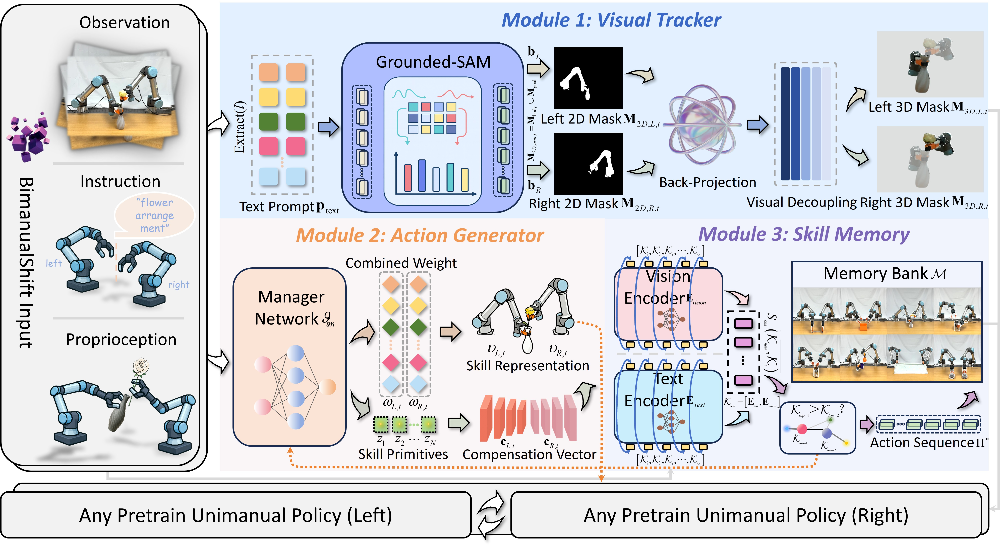

<div align="center">

# BimanualShift: Transferring Unimanual Policy for General Bimanual Manipulation

[](https://github.com/pre-commit/pre-commit)
[](https://pytorch.org/get-started/locally/)
[](https://wandb.ai/site/)
[](https://github.com/ashleve/lightning-hydra-template#license)

Yechen Fan, Xianyou Ji, Chenyang Song, Huixin He, Haibin Wu, Jinhua Ye <sup>†</sup>, Gengfeng Zheng <sup>†</sup>

**[[Project Page](https://yechen056.github.io/Bift/)] | [[Paper]()]**

</div>

# 📖 Overview
<p align="center">
  
</p>

**BimanualShift** is a modular transfer framework for general bimanual manipulation. Instead of learning dual-arm control from scratch, it reuses **fully frozen pretrained unimanual policies** and equips them with lightweight adaptation modules for perception, coordination, and memory.

# 💻 Installation

See [INSTALL.md](INSTALLATION.md) for installation instructions. 

# 🚀 Quick Start

### 📥 1. Data Acquisition

Please download the RLBench2 demonstrations from [Dataset](https://bimanual.github.io). All image observations are provided at `256x256` resolution.

### 🧠 2. Training
Before training, please download the pretrained single-arm PerAct model and place it under `BimanualShift/bift`:
```bash
cd /home/yechen/BimanualShift/bift
wget https://github.com/peract/peract/releases/download/v1.0.0/peract_600k.zip
unzip peract_600k.zip
```

To train our BimanualShift policy, run:
```bash
cd /home/yechen/BimanualShift
conda activate rlbench
python /home/yechen/BimanualShift/scripts/train.py \
  method=BIMANUALSHIFT_PERACT \
  rlbench.tasks=[YOUR_TASK] \
  rlbench.task_name=YOUR_EXPERIMENT_NAME \
  framework.logdir=/home/yechen/BimanualShift/outputs \
  framework.training_iterations=30001 \
  replay.batch_size=1 \
  framework.use_pretrained=True \
  framework.pretrained_weights_dir=/home/yechen/BimanualShift/bift/peract_600k/ckpts/multi/PERACT_BC/seed0/weights/600000
```

### 🤖 3. Evaluation
To evaluate a checkpoint in simulation, you can use:
```bash
cd /home/yechen/BimanualShift
conda activate rlbench
python /home/yechen/BimanualShift/scripts/eval.py \
  method=BIMANUALSHIFT_PERACT \
  framework.logdir=/home/yechen/BimanualShift/outputs \
  rlbench.task_name=YOUR_EXPERIMENT_NAME \
  rlbench.tasks=[YOUR_TASK] \
  framework.eval_type=30000 \
  framework.eval_episodes=20
```

# 📄  License
This project is released under the [MIT License](LICENSE).

# 🙏 Acknowledgement

Our code is generally built upon: [Perceiver-Actor^2](https://github.com/markusgrotz/peract_bimanual), [PerAct](https://github.com/peract/peract), [RLBench](https://github.com/stepjam/RLBench), [RVT](https://github.com/nvlabs/rvt), and [AnyBimanual](https://github.com/Tengbo-Yu/AnyBimanual). We thank all these authors for their nicely open sourced code and their great contributions to the community.
